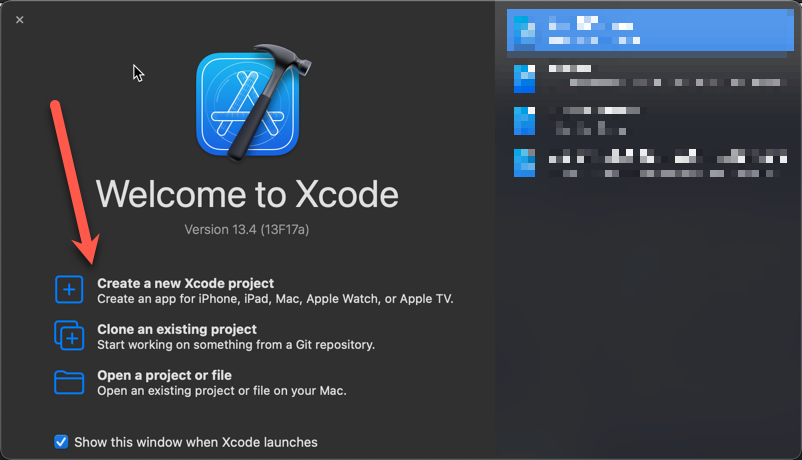
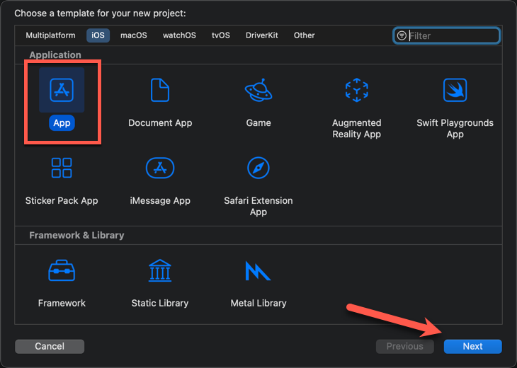
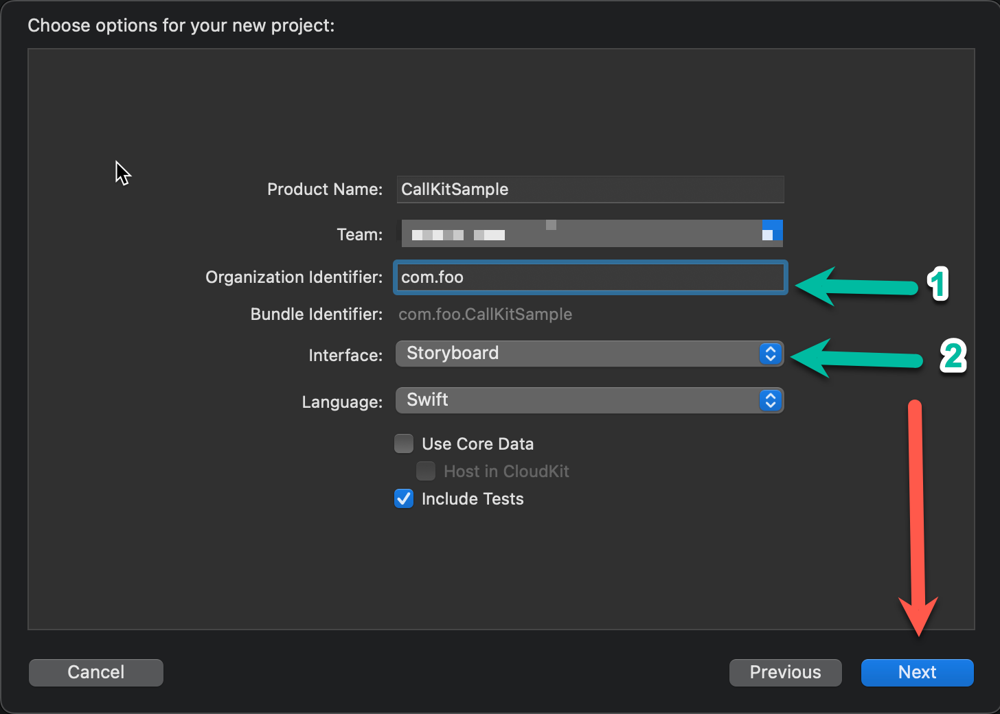
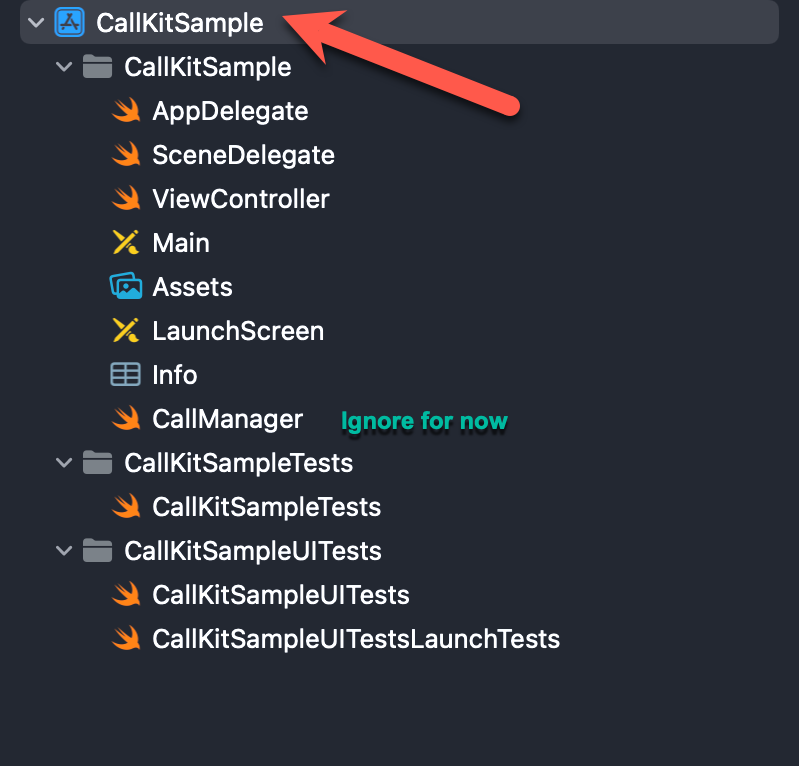
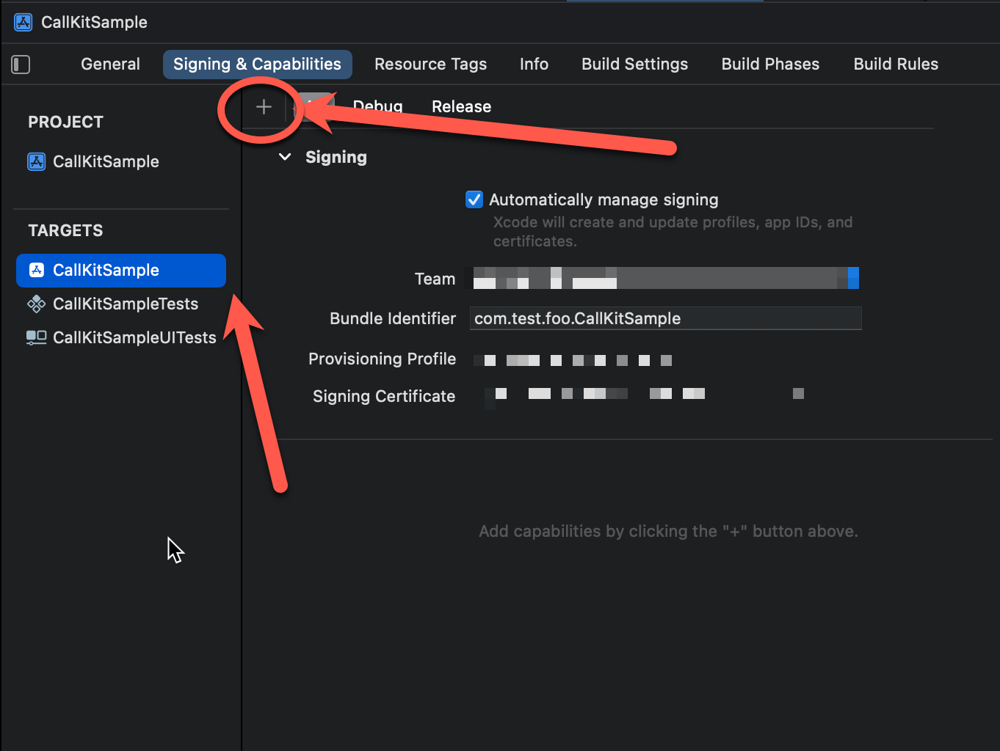
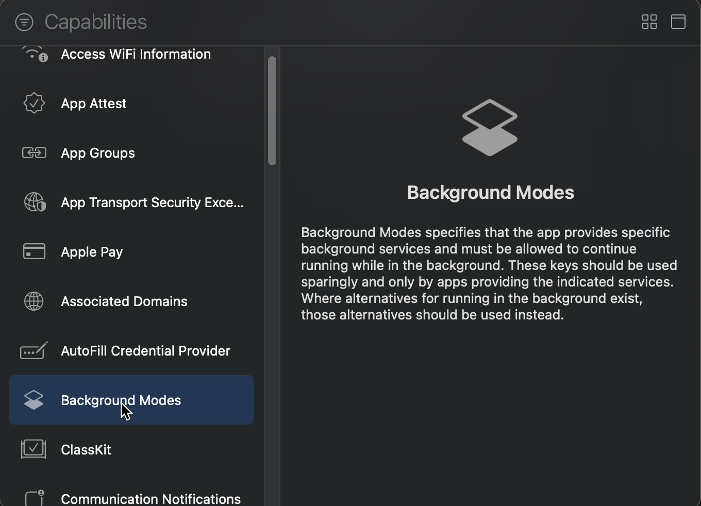
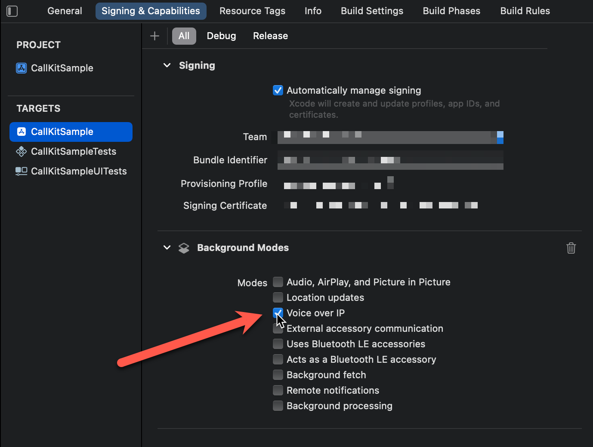

+++
author = "Huzefa Dargahwala"
title = "Handling Incoming Calls using CallKit on iOS"
date = "2022-12-05"
description = "Explains the key concepts of receiving an incoming VoIP call on your iOS app"
tags = [
    "xcode",
    "iOS",
    "CallKit",
    "iPhone",
]
+++

__Date__: 5 December 2022

# Introduction

This is Part 1 of a 2-part post about using CallKit in your iOS app. In this part, I will explain the key concepts of receiving an incoming VoIP call on your iOS app. I will also go over common gotchas while setting up the project to use CallKit correctly.

I won't take time to explain what CallKit is, I have quoted short explanations from Apple and Kodeco and linked references to the docs in the end. At a high-level, if you want a long-running audio video teleconferencing VoIP Capability in your application, you will have to understand and utilitze CallKit.

__Apple Docs__

> Use CallKit to integrate your calling services with other call-related apps on the system. CallKit provides the calling interface, and you handle the back-end communication with your VoIP service.

__Kodeco__

> CallKit is a framework that aims to improve the VoIP experience by allowing apps to integrate with the native phone UI. 

---
# Project Setup

My [code is available on GitHub](https://github.com/vizkid2005/CallKitSample), feel free to clone/fork it and use it for your own Proof-of-Concept purposes. 

## Pre-requisites

1. XCode - See installation instructions here. Latest stable version of XCode should be fine for this example. I am using 13.4 in this example
2. Physical iOS device - CallKit does not work on iOS Simulator. You need a physical device to test functionality. When it initially did not work me, I scratched my head for a couple of hours tyring to figure out why my app wasn't working as expected on the Simulator. I found a [relevant post](https://stackoverflow.com/questions/65501603/is-it-possible-to-receive-calls-using-callkit-in-ios-simulator) on StackOverflow.
3. Apple Developer Account - Essentially to enable Pre-requisite #2.

## Basic Setup

1. Open XCode
2. Select `Create a new Project`
   
3. Select an empty app project
   
4. Give your project a name
   
	1. Give your app a bundle identifier. You can read more about it [here](https://cocoacasts.com/what-are-app-ids-and-bundle-identifiers/)
	2. Choose either __Storyboard__ or __SwiftUI__ for your interface. I've left it to __Storyboard__.
	3. Click Next
5. Save it in your place of choice

## Configure the app to enable Voice over IP

This part of the setup is essential in order to enable Voice over IP. Your app will not work as expected without this setting. Many tutorials gloss over this part and I spent some time playing around with this. So make sure you do this step.

1. In the Project Structure pane on the left, Select Project name with the blue icon
   
2. Click the + Button under the __Signing & Capabilities__ tab
   
3. Select __Background Modes__
   
4. Select __Add Voice over IP__
   

We have now successfully configured a skeleton application. 

# CallKit Concepts

## CXProvider 

This is the entry point for your app for the native telephony experience. Only 1 instance of this class should be created per application. This class contains the method that you need to call when your VoIP application an incoming for the user. More detailed documentation is linked [here](https://developer.apple.com/documentation/callkit/cxprovider)

## CXProviderDelegate

This is a [protocol](https://docs.swift.org/swift-book/LanguageGuide/Protocols.html) that you need to implement in order to receive system callbacks about the lifecycle of a call. Once implemented, the implementor of this protocol needs to be registered with the `CXProvider`. 

# Implementation

## UI Setup



We not going to spend time delving into iOS UI concepts. Enough has been written online in articles/tutorials about iOS interface design. To get started use my project code on Github and it will give you the most basic UI to work with. 

Your VoIP application will have some mechanism (most likely PushKit) of receiving a notification about an incoming call. We need to take that notification and turn it into a iOS-native telephone call that the user can be notified with. To simulate this we have hooked up the `Incoming Call` button on the UI to trigger an incoming call with the `handleIncomingButtonPress` callback.

```
import UIKit
import OSLog
import CallKit

class ViewController: UIViewController{

// Ideally this object would live at app-level scope
// For this simple example, we can keep it in this single ViewController
var callManager: CallManager? = nil

override func viewDidLoad() {
	super.viewDidLoad()
	callManager = CallManager()
}

@IBAction func handleIncomingButtonPress(_ sender: UIButton) {
	os_log("Incmoing Call Button Pressed", type: .debug)
	callManager?.reportIncomingPhoneCall(callerName: "Jack", phoneNumber: "(123)-456-7890")
}

}
```

## CallManager

This class manages the ongoing call for your application. 

It holds the reference to a `CXProvider` object that it will use for the rest of the app life-cycle. It also implements the `CXProviderDelegate` protocol and registers itself as the delegate to `CXProvider`. 

```
import CallKit
import OSLog

class CallManager: NSObject, CXProviderDelegate {
	var callProvider: CXProvider
	var ongoingCallID: UUID? = nil

	override init() {
		self.callProvider = CXProvider(configuration: CXProviderConfiguration())
		super.init()

		// Setting the queue to nil will result on delegate methods
		// to be called on the main queue, this is ok for this sample project.
		// As the project grows in complexity, we have to off-load a separate queue.
		self.callProvider.setDelegate(self, queue: nil)
	}

	func provider(_ provider: CXProvider, perform action: CXAnswerCallAction) {
		os_log("Call was Answered", type: .debug)
		action.fulfill()
	}

	func provider(_ provider: CXProvider, perform action: CXEndCallAction) {
		os_log("Call was Ended", type: .debug)
		action.fulfill()
	}

	// I have skipped the rest of the provider methods for brevity
	// For adding more callbacks, refer to
	// https://developer.apple.com/documentation/callkit/cxproviderdelegate

	func providerDidReset(_ provider: CXProvider) {
		os_log("Provider was reset", type: .debug)
		// We should end any in-progress calls and start with a clean slate
	}

	// Create an audio-only phone call with a phone number
	func reportIncomingPhoneCall(callerName: String, phoneNumber: String) {
		os_log("Reporting an incoming phone call", type: .debug)
		
		// Configure the call
		let update = CXCallUpdate()
		update.localizedCallerName = callerName
		update.hasVideo = false
		let callerHandle = CXHandle(type: .phoneNumber, value: phoneNumber)
		update.remoteHandle = callerHandle
		
		// Create a UUID for the call to be managed, each call should have
		// a unique ID
		let callID = UUID()
		
		callProvider.reportNewIncomingCall(with: callID, update: update) {err in
			if err != nil {
				os_log("Error reporting an incoming call %@",
					   type: .error,
					   String(describing: err))
			
				self.ongoingCallID = nil
			}
		}
		ongoingCallID = callID
	}
}
```

The `CXProviderDelegate` also provides the ability to define methods that handle various callbacks around the phone call's lifecycle. These can be used to do things like clean-up resources on call hang-up, etc. 

# References
1. https://developer.apple.com/documentation/callkit
2. https://www.kodeco.com/1276414-callkit-tutorial-for-ios
3. https://stackoverflow.com/questions/65501603/is-it-possible-to-receive-calls-using-callkit-in-ios-simulator
4. https://docs.swift.org/swift-book/LanguageGuide/Protocols.html